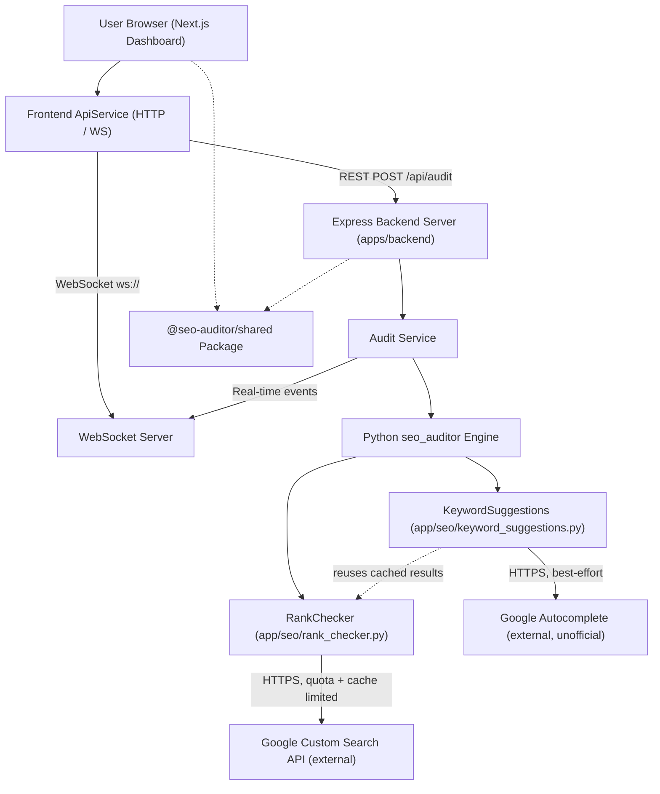

# Architecture Overview

### Components

1. **Frontend App (`apps/frontend`)**:
   - Next.js 14 App Router, Tailwind CSS, Lucide Icons, Recharts.
   - Communicates strictly via `ApiService` without direct backend imports.

2. **Backend App (`apps/backend`)**:
   - Express REST API server + `ws` WebSocket server.
   - Invokes Python `seo_auditor` engine asynchronously for high-performance BFS crawling and SEO scoring.
   - `RankChecker` and `KeywordSuggestions` are the only components that call external services beyond the crawl target itself: the official Google Custom Search JSON API (100 free queries/day, cached and quota-limited) and the unofficial Google Autocomplete endpoint (best-effort, failures are swallowed at debug level). Both are off by default and the audit succeeds identically without them configured. Note the gating is per-component, not per-feature: `enable_rank_check` gates `RankChecker`/Google CSE, and `enable_keyword_suggestions` — not `enable_keyword_analysis` — gates `KeywordSuggestions`/Google Autocomplete. `enable_keyword_analysis` only controls on-page keyword *extraction*, which is pure local computation and makes no external calls of its own.

3. **Shared Package (`packages/shared`)**:
   - Single source of truth for TypeScript types, request DTOs, severity constants, and URL validators.
