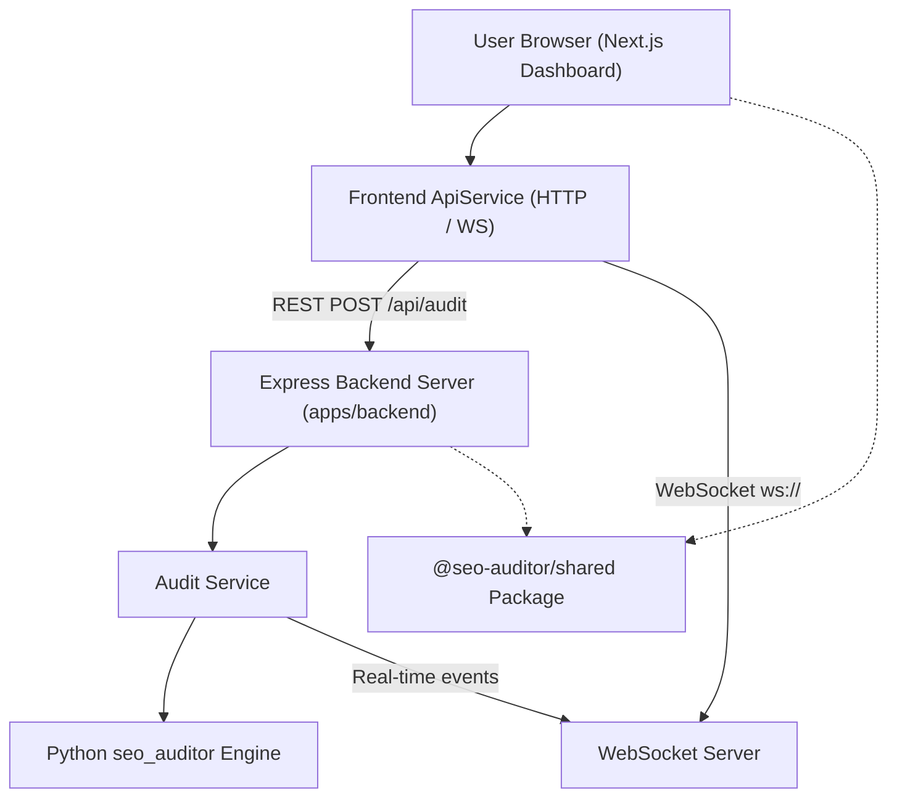

# Architecture Overview

### Components

1. **Frontend App (`apps/frontend`)**:
   - Next.js 14 App Router, Tailwind CSS, Lucide Icons, Recharts.
   - Communicates strictly via `ApiService` without direct backend imports.

2. **Backend App (`apps/backend`)**:
   - Express REST API server + `ws` WebSocket server.
   - Invokes Python `seo_auditor` engine asynchronously for high-performance BFS crawling and SEO scoring.

3. **Shared Package (`packages/shared`)**:
   - Single source of truth for TypeScript types, request DTOs, severity constants, and URL validators.
