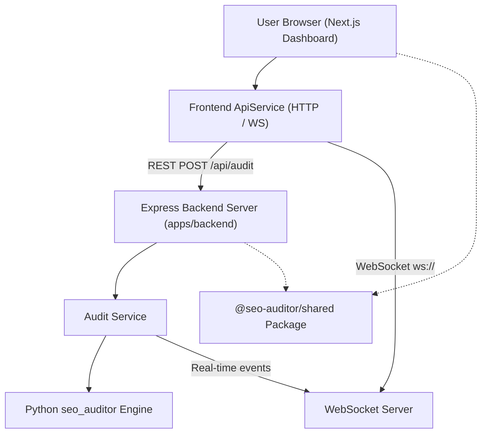
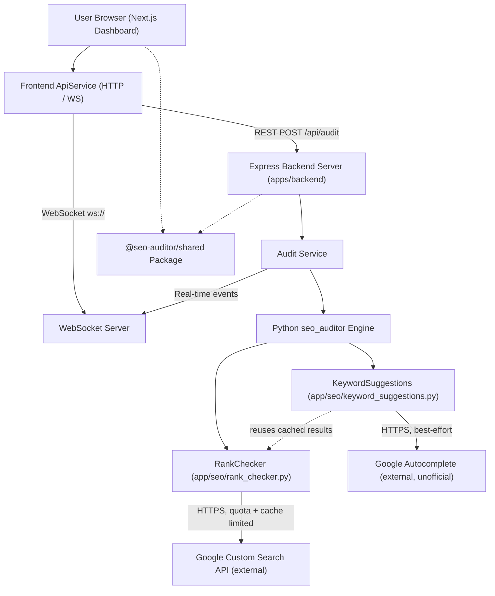

# Keyword Intelligence Implementation Plan

> **For agentic workers:** REQUIRED SUB-SKILL: Use superpowers:subagent-driven-development (recommended) or superpowers:executing-plans to implement this plan task-by-task. Steps use checkbox (`- [ ]`) syntax for tracking.

**Goal:** Add per-page keyword extraction, live Google-rank checking, and keyword suggestions to the SEO audit pipeline, using only free/official data sources, wired into both copies of the Python audit engine and surfaced in a new frontend panel.

**Architecture:** Three new pure-logic Python modules (`keyword_extraction.py`, `rank_checker.py`, `keyword_suggestions.py`) live under a new `seo/` subpackage in both `apps/backend/app/` and `apps/backend/seo_auditor/seo_auditor/` (identical content, mirroring this repo's existing duplication of `checks.py`/`crawler.py`/etc.). They're wired into each tree's per-page audit loop, ride through to the frontend on the existing `PageItem` shape (`keyword_analysis` field), and render in a new `keyword-panel.tsx` dashboard panel.

**Tech Stack:** Python (`requests`, `re`, stdlib only — no new dependencies), FastAPI/Pydantic, Next.js/TypeScript/React, Vitest + React Testing Library, pytest.

**Full design context:** `docs/superpowers/specs/2026-08-11-keyword-intelligence-design.md` — read it if anything below is ambiguous; this plan implements it exactly, with a few signature refinements discovered during planning (noted inline where they occur).

## Global Constraints

- No new heavyweight dependencies (no spaCy/NLTK/Selenium/Playwright). `requests` is the only HTTP client, for both the Google CSE call and the Autocomplete call.
- `enable_keyword_analysis` defaults **on** (pure on-page extraction, no external calls). `enable_rank_check` and `enable_competitor_gap` default **off** (cost Google CSE quota and/or extra latency).
- An audit with no `GOOGLE_CSE_API_KEY`/`GOOGLE_CSE_CX` configured must produce the same successful result as today, just with a "not configured" note per keyword — never an error, never a crash, never a silently-skipped audit.
- Style: plain dicts (no ORM/dataclass models), `logger.error(..., exc_info=exc)` for anything that would otherwise be an uncaught exception, tests as fakes/mocks — no live network calls in the test suite.
- The two backend trees (`apps/backend/app/` and `apps/backend/seo_auditor/seo_auditor/`) must end up byte-for-byte identical in the new `seo/` modules, differing only in import lines (matching how `checks.py` already differs between the trees by exactly one import line).
- Run `pytest tests/ -q` (from `apps/backend`) and `npx vitest run` + `npx tsc --noEmit` (from `apps/frontend`) after every task that touches code. All must stay green throughout.

---

### Task 1: Config and schema additions (app tree)

**Files:**
- Modify: `apps/backend/app/config/config.py`
- Modify: `apps/backend/.env.example`
- Modify: `apps/backend/app/schemas/schemas.py`

**Interfaces:**
- Produces: `config.GOOGLE_CSE_API_KEY: str`, `config.GOOGLE_CSE_CX: str`, `config.GOOGLE_CSE_DAILY_QUOTA: int`, `config.GOOGLE_CSE_MAX_KEYWORDS_PER_PAGE: int`, `config.GOOGLE_CSE_CACHE_TTL_HOURS: int` — consumed by Task 3/4/5.
- Produces: `AuditRequestParams.enable_keyword_analysis: Optional[bool]`, `.enable_rank_check: Optional[bool]`, `.enable_competitor_gap: Optional[bool]`, `.target_keywords: Optional[List[str]]` — consumed by Task 5.

- [ ] **Step 1: Add the 5 env vars to `config.py`**

Current end of file:
```python
import os

PORT = int(os.getenv("PORT", "5000"))
HOST = os.getenv("HOST", "0.0.0.0")
MAX_PAGES_CAP = int(os.getenv("MAX_PAGES", "15"))
MAX_DEPTH_CAP = int(os.getenv("MAX_DEPTH", "2"))
CRAWL_TIMEOUT = int(os.getenv("CRAWL_TIMEOUT", "10"))
```

Append:
```python
GOOGLE_CSE_API_KEY = os.getenv("GOOGLE_CSE_API_KEY", "")
GOOGLE_CSE_CX = os.getenv("GOOGLE_CSE_CX", "")
GOOGLE_CSE_DAILY_QUOTA = int(os.getenv("GOOGLE_CSE_DAILY_QUOTA", "100"))
GOOGLE_CSE_MAX_KEYWORDS_PER_PAGE = int(os.getenv("GOOGLE_CSE_MAX_KEYWORDS_PER_PAGE", "3"))
GOOGLE_CSE_CACHE_TTL_HOURS = int(os.getenv("GOOGLE_CSE_CACHE_TTL_HOURS", "24"))
```

- [ ] **Step 2: Add the same 5 keys to `.env.example`**

Current file:
```
PORT=5000
NODE_ENV=development
CRAWL_TIMEOUT=10
MAX_DEPTH=2
HF_TOKEN=
```

New file:
```
PORT=5000
NODE_ENV=development
CRAWL_TIMEOUT=10
MAX_DEPTH=2
HF_TOKEN=
GOOGLE_CSE_API_KEY=
GOOGLE_CSE_CX=
GOOGLE_CSE_DAILY_QUOTA=100
GOOGLE_CSE_MAX_KEYWORDS_PER_PAGE=3
GOOGLE_CSE_CACHE_TTL_HOURS=24
```

- [ ] **Step 3: Add the 4 new fields to `AuditRequestParams`**

Current:
```python
class AuditRequestParams(BaseModel):
    url: str
    max_pages: Optional[int] = Field(default=8, ge=1, le=5000)
    max_depth: Optional[int] = Field(default=1, ge=0, le=15)
    ignore_robots: Optional[bool] = False
```

New:
```python
class AuditRequestParams(BaseModel):
    url: str
    max_pages: Optional[int] = Field(default=8, ge=1, le=5000)
    max_depth: Optional[int] = Field(default=1, ge=0, le=15)
    ignore_robots: Optional[bool] = False
    enable_keyword_analysis: Optional[bool] = True
    enable_rank_check: Optional[bool] = False
    enable_competitor_gap: Optional[bool] = False
    target_keywords: Optional[List[str]] = None
```

- [ ] **Step 4: Verify**

Run: `cd apps/backend && python -c "from app.schemas.schemas import AuditRequestParams; from app.config import config; p = AuditRequestParams(url='https://example.com'); print(p.enable_keyword_analysis, p.enable_rank_check, config.GOOGLE_CSE_DAILY_QUOTA)"`
Expected output: `True False 100`

- [ ] **Step 5: Run full backend suite to confirm no regression**

Run: `cd apps/backend && python -m pytest tests/ -q`
Expected: `7 passed` (same as before this task — this is a purely additive, no-logic-branch change)

- [ ] **Step 6: Commit**

```bash
git add apps/backend/app/config/config.py apps/backend/.env.example apps/backend/app/schemas/schemas.py
git commit -m "feat: add Google CSE config and keyword-analysis request params"
```

---

### Task 2: `keyword_extraction.py` (app tree, TDD)

**Files:**
- Create: `apps/backend/app/seo/keyword_extraction.py`
- Test: `apps/backend/tests/test_keyword_extraction.py`

**Interfaces:**
- Consumes: `app.auditor.checks.STOP_WORDS: set[str]` (already exists).
- Produces: `extract_keywords(page_meta: dict, content_stats: dict, top_n: int = 8) -> list[dict]`, each dict `{"phrase": str, "score": float, "found_in": list[str]}` — consumed by Task 4, Task 5.

- [ ] **Step 1: Write the failing tests**

Create `apps/backend/tests/test_keyword_extraction.py`:
```python
from app.seo import keyword_extraction


def test_extract_keywords_weights_fields_by_importance():
    page_meta = {
        "title": "",
        "h1": "Roasting",
        "meta_description": "Brewing",
        "heading_hierarchy": [],
    }
    content_stats = {"text": ""}

    result = keyword_extraction.extract_keywords(page_meta, content_stats)
    scores = {r["phrase"]: r["score"] for r in result}

    assert scores["roasting"] == 2.5
    assert scores["brewing"] == 2.0
    assert scores["roasting"] > scores["brewing"]


def test_extract_keywords_filters_stop_words():
    page_meta = {
        "title": "This is a Guide for Beginners",
        "h1": "",
        "meta_description": "",
        "heading_hierarchy": [],
    }
    content_stats = {"text": ""}

    result = keyword_extraction.extract_keywords(page_meta, content_stats)
    phrases = [r["phrase"] for r in result]

    assert not any(p in ("this", "is", "a", "for") for p in phrases)
    assert "guide" in phrases
    assert "beginners" in phrases


def test_extract_keywords_builds_ngram_phrases_up_to_three_words():
    page_meta = {
        "title": "Trail Running Shoes",
        "h1": "",
        "meta_description": "",
        "heading_hierarchy": [],
    }
    content_stats = {"text": ""}

    result = keyword_extraction.extract_keywords(page_meta, content_stats)
    phrases = {r["phrase"] for r in result}

    assert "trail running shoes" in phrases
    assert "trail running" in phrases
    assert "running shoes" in phrases
```

- [ ] **Step 2: Run tests to verify they fail**

Run: `cd apps/backend && python -m pytest tests/test_keyword_extraction.py -v`
Expected: `ModuleNotFoundError: No module named 'app.seo'`

- [ ] **Step 3: Write the implementation**

Create `apps/backend/app/seo/keyword_extraction.py`:
```python
"""
keyword_extraction.py — On-page keyword extraction via weighted n-gram frequency.

Pure logic: no network calls, no new dependencies. Supersedes the old,
uncalled `keyword_density()` helper in checks.py — that function is left in
place (removing it is a separate cleanup) but this module is what the audit
pipeline actually uses for keyword extraction.
"""

from __future__ import annotations

import re
from collections import Counter
from typing import Dict, List

from app.auditor.checks import STOP_WORDS

FIELD_WEIGHTS = {
    "title": 3.0,
    "h1": 2.5,
    "meta_description": 2.0,
    "headings": 1.5,
    "body": 1.0,
}


def _tokenize(text: str) -> List[str]:
    return re.findall(r"[a-z']+", text.lower())


def _is_content_word(token: str) -> bool:
    return token not in STOP_WORDS and len(token) > 2


def _phrases_from_text(text: str) -> List[str]:
    tokens = _tokenize(text)
    phrases: List[str] = []
    for n in (1, 2, 3):
        for i in range(len(tokens) - n + 1):
            gram = tokens[i:i + n]
            if all(_is_content_word(t) for t in gram):
                phrases.append(" ".join(gram))
    return phrases


def extract_keywords(page_meta: Dict, content_stats: Dict, top_n: int = 8) -> List[Dict]:
    field_text = {
        "title": page_meta.get("title") or "",
        "h1": page_meta.get("h1") or "",
        "meta_description": page_meta.get("meta_description") or "",
        "headings": " ".join(h.get("text", "") for h in (page_meta.get("heading_hierarchy") or [])),
        "body": content_stats.get("text") or "",
    }

    scores: Dict[str, float] = {}
    found_in: Dict[str, List[str]] = {}

    for field, text in field_text.items():
        if not text:
            continue
        weight = FIELD_WEIGHTS[field]
        for phrase, count in Counter(_phrases_from_text(text)).items():
            scores[phrase] = scores.get(phrase, 0.0) + count * weight
            found_in.setdefault(phrase, [])
            if field not in found_in[phrase]:
                found_in[phrase].append(field)

    ranked = sorted(scores.items(), key=lambda kv: (-kv[1], kv[0]))
    return [
        {"phrase": phrase, "score": round(score, 2), "found_in": found_in[phrase]}
        for phrase, score in ranked[:top_n]
    ]
```

- [ ] **Step 4: Run tests to verify they pass**

Run: `cd apps/backend && python -m pytest tests/test_keyword_extraction.py -v`
Expected: `3 passed`

- [ ] **Step 5: Run full backend suite**

Run: `cd apps/backend && python -m pytest tests/ -q`
Expected: `10 passed` (7 existing + 3 new)

- [ ] **Step 6: Commit**

```bash
git add apps/backend/app/seo/keyword_extraction.py apps/backend/tests/test_keyword_extraction.py
git commit -m "feat: add on-page keyword extraction module"
```

---

### Task 3: `rank_checker.py` (app tree, TDD)

**Files:**
- Create: `apps/backend/app/seo/rank_checker.py`
- Test: `apps/backend/tests/test_rank_checker.py`

**Interfaces:**
- Consumes: a `config`-like object with `GOOGLE_CSE_API_KEY`, `GOOGLE_CSE_CX`, `GOOGLE_CSE_DAILY_QUOTA`, `GOOGLE_CSE_MAX_KEYWORDS_PER_PAGE`, `GOOGLE_CSE_CACHE_TTL_HOURS` attributes (produced by Task 1's `config.py`, or a test fake).
- Produces: `check_rankings(page_url: str, keywords: list[str], config, deep_rank_check: bool = False) -> list[dict]`, each dict `{"keyword": str, "position": int | None, "note": str | None, "checked_at": str, "top_urls": list[str]}` — consumed by Task 4, Task 5.

> Note: the spec (§4.2) requires `deep_rank_check` to be *accepted* as an opt-in flag but explicitly puts implementing page-2+ pagination behind it out of scope (each extra page is another quota-consuming query). It's accepted here as a documented no-op — the original request's own schema snippet (§3.3) doesn't surface it on `AuditRequestParams` either, so it isn't wired through the request/response path, only reserved on `check_rankings` itself for whoever implements real pagination later.
- Produces: `_get_cse_results(keyword: str, target_domain: str, config) -> tuple[list[str] | None, str | None]` and `_domain(url: str) -> str` — module-level, consumed directly by Task 4's `keyword_suggestions.py` for the competitor-gap path (this is the single place cache/quota bookkeeping lives; Task 4 must not duplicate it).

- [ ] **Step 1: Write the failing tests**

Create `apps/backend/tests/test_rank_checker.py`:
```python
from types import SimpleNamespace
from unittest.mock import MagicMock, patch

import pytest

from app.seo import rank_checker

FAKE_CONFIG = SimpleNamespace(
    GOOGLE_CSE_API_KEY="test-key",
    GOOGLE_CSE_CX="test-cx",
    GOOGLE_CSE_DAILY_QUOTA=100,
    GOOGLE_CSE_MAX_KEYWORDS_PER_PAGE=3,
    GOOGLE_CSE_CACHE_TTL_HOURS=24,
)


@pytest.fixture(autouse=True)
def _reset_state():
    rank_checker._state.reset()
    yield
    rank_checker._state.reset()


def _canned_response(items):
    resp = MagicMock()
    resp.raise_for_status = MagicMock()
    resp.json.return_value = {"items": items}
    return resp


def test_check_rankings_parses_position_from_cse_response():
    items = [{"link": f"https://competitor{i}.com/"} for i in range(4)]
    items.insert(2, {"link": "https://www.example.com/page/?utm=1"})

    with patch("app.seo.rank_checker.requests.get", return_value=_canned_response(items)) as mock_get:
        result = rank_checker.check_rankings("https://example.com/page", ["espresso machine"], FAKE_CONFIG)

    assert result[0]["keyword"] == "espresso machine"
    assert result[0]["position"] == 3
    mock_get.assert_called_once()


def test_check_rankings_not_found_in_top_10():
    items = [{"link": f"https://competitor{i}.com/"} for i in range(10)]

    with patch("app.seo.rank_checker.requests.get", return_value=_canned_response(items)):
        result = rank_checker.check_rankings("https://example.com/page", ["espresso machine"], FAKE_CONFIG)

    assert result[0]["position"] is None
    assert result[0]["note"] == "not found in top 10"


def test_check_rankings_cache_hit_avoids_second_request():
    items = [{"link": "https://example.com/page"}]

    with patch("app.seo.rank_checker.requests.get", return_value=_canned_response(items)) as mock_get:
        rank_checker.check_rankings("https://example.com/page", ["espresso machine"], FAKE_CONFIG)
        rank_checker.check_rankings("https://example.com/page", ["espresso machine"], FAKE_CONFIG)

    assert mock_get.call_count == 1


def test_check_rankings_quota_exhaustion_produces_skipped_note():
    quota_config = SimpleNamespace(**{**FAKE_CONFIG.__dict__, "GOOGLE_CSE_DAILY_QUOTA": 1})
    items = [{"link": "https://competitor.com/"}]

    with patch("app.seo.rank_checker.requests.get", return_value=_canned_response(items)) as mock_get:
        result = rank_checker.check_rankings(
            "https://example.com/page", ["espresso machine", "pour over"], quota_config
        )

    assert mock_get.call_count == 1
    assert result[1]["note"] == "ranking check skipped — daily Google CSE quota reached"
    assert result[1]["position"] is None


def test_check_rankings_deep_rank_check_flag_is_accepted_as_a_noop():
    items = [{"link": f"https://competitor{i}.com/"} for i in range(10)]

    with patch("app.seo.rank_checker.requests.get", return_value=_canned_response(items)) as mock_get:
        result = rank_checker.check_rankings(
            "https://example.com/page", ["espresso machine"], FAKE_CONFIG, deep_rank_check=True
        )

    # Pagination isn't implemented yet — passing the flag must not change
    # behavior or issue a second (page-2) request.
    assert mock_get.call_count == 1
    assert result[0]["position"] is None
    assert result[0]["note"] == "not found in top 10"


def test_check_rankings_without_credentials_skips_cleanly():
    unconfigured = SimpleNamespace(
        GOOGLE_CSE_API_KEY="",
        GOOGLE_CSE_CX="",
        GOOGLE_CSE_DAILY_QUOTA=100,
        GOOGLE_CSE_MAX_KEYWORDS_PER_PAGE=3,
        GOOGLE_CSE_CACHE_TTL_HOURS=24,
    )

    with patch("app.seo.rank_checker.requests.get") as mock_get:
        result = rank_checker.check_rankings("https://example.com/page", ["espresso machine"], unconfigured)

    mock_get.assert_not_called()
    assert result[0]["position"] is None
    assert result[0]["note"] == "ranking check unavailable — Google CSE not configured"
```

- [ ] **Step 2: Run tests to verify they fail**

Run: `cd apps/backend && python -m pytest tests/test_rank_checker.py -v`
Expected: `ModuleNotFoundError: No module named 'app.seo.rank_checker'` (or a collection error — `app/seo/` exists from Task 2 but `rank_checker.py` doesn't yet)

- [ ] **Step 3: Write the implementation**

Create `apps/backend/app/seo/rank_checker.py`:
```python
"""
rank_checker.py — Live Google ranking checks via the official Custom Search
JSON API (100 free queries/day). Owns an in-memory cache + daily quota
counter so a multi-page crawl doesn't blow through the quota on day one.
"""

from __future__ import annotations

import re
from datetime import datetime, timedelta, timezone
from typing import Dict, List, Optional, Tuple
from urllib.parse import urlparse

import requests

CSE_ENDPOINT = "https://www.googleapis.com/customsearch/v1"

_NOTES = {
    "not_configured": "ranking check unavailable — Google CSE not configured",
    "quota_reached": "ranking check skipped — daily Google CSE quota reached",
    "error": "ranking check failed — Google CSE request error",
}


class _RankCheckState:
    """In-memory cache + daily quota counter, mirroring session_model.py's
    SessionStore pattern: no DB, no persistence beyond process lifetime."""

    def __init__(self) -> None:
        self._cache: Dict[Tuple[str, str], Dict] = {}
        self._quota_date = None
        self._quota_used = 0

    def get_cached(self, key: Tuple[str, str], ttl_hours: int) -> Optional[List[str]]:
        entry = self._cache.get(key)
        if not entry:
            return None
        if datetime.now(timezone.utc) - entry["cached_at"] > timedelta(hours=ttl_hours):
            return None
        return entry["urls"]

    def set_cached(self, key: Tuple[str, str], urls: List[str]) -> None:
        self._cache[key] = {"urls": urls, "cached_at": datetime.now(timezone.utc)}

    def _reset_quota_if_new_day(self) -> None:
        today = datetime.now(timezone.utc).date()
        if self._quota_date != today:
            self._quota_date = today
            self._quota_used = 0

    def can_query(self, daily_quota: int) -> bool:
        self._reset_quota_if_new_day()
        return self._quota_used < daily_quota

    def record_query(self) -> None:
        self._reset_quota_if_new_day()
        self._quota_used += 1

    def reset(self) -> None:
        """Test-only: clear cache and quota usage."""
        self._cache.clear()
        self._quota_date = None
        self._quota_used = 0


_state = _RankCheckState()


def _normalize_url(url: str) -> str:
    url = url.split("#")[0].split("?")[0]
    url = re.sub(r"^https?://", "", url)
    url = re.sub(r"^www\.", "", url)
    return url.rstrip("/")


def _domain(url: str) -> str:
    netloc = (urlparse(url).netloc or url).lower()
    if netloc.startswith("www."):
        netloc = netloc[4:]
    return netloc


def _get_cse_results(keyword: str, target_domain: str, config) -> Tuple[Optional[List[str]], Optional[str]]:
    """Cache-or-live CSE lookup for one keyword.

    Returns (urls, skip_reason): urls is a list on success (possibly empty),
    None on any skip/failure; skip_reason is None on success else one of
    "not_configured" | "quota_reached" | "error".

    This is the single place cache/quota bookkeeping happens — both
    check_rankings() and keyword_suggestions.py's competitor-gap path call
    this directly rather than duplicating the logic.
    """
    if not config.GOOGLE_CSE_API_KEY or not config.GOOGLE_CSE_CX:
        return None, "not_configured"

    cache_key = (keyword, target_domain)
    cached = _state.get_cached(cache_key, config.GOOGLE_CSE_CACHE_TTL_HOURS)
    if cached is not None:
        return cached, None

    if not _state.can_query(config.GOOGLE_CSE_DAILY_QUOTA):
        return None, "quota_reached"

    try:
        resp = requests.get(
            CSE_ENDPOINT,
            params={"key": config.GOOGLE_CSE_API_KEY, "cx": config.GOOGLE_CSE_CX, "q": keyword, "num": 10},
            timeout=10,
        )
        resp.raise_for_status()
        data = resp.json()
        urls = [item["link"] for item in data.get("items", []) if "link" in item]
    except Exception:
        return None, "error"

    _state.record_query()
    _state.set_cached(cache_key, urls)
    return urls, None


def check_rankings(
    page_url: str, keywords: List[str], config, deep_rank_check: bool = False
) -> List[Dict]:
    # `deep_rank_check` is reserved for future page-2+ pagination support
    # (each extra page is another quota-consuming query) — accepted here so
    # callers can opt in without a breaking signature change later, but it
    # has no effect yet: only the first page of CSE results is ever checked.
    target_domain = _domain(page_url)
    norm_page = _normalize_url(page_url)
    capped = keywords[: config.GOOGLE_CSE_MAX_KEYWORDS_PER_PAGE]

    results = []
    for kw in capped:
        checked_at = datetime.now(timezone.utc).isoformat()
        urls, skip_reason = _get_cse_results(kw, target_domain, config)
        if urls is None:
            results.append({
                "keyword": kw,
                "position": None,
                "note": _NOTES[skip_reason],
                "checked_at": checked_at,
                "top_urls": [],
            })
            continue

        position = None
        for i, link in enumerate(urls, start=1):
            if _normalize_url(link) == norm_page:
                position = i
                break

        results.append({
            "keyword": kw,
            "position": position,
            "note": None if position else "not found in top 10",
            "checked_at": checked_at,
            "top_urls": urls,
        })
    return results
```

- [ ] **Step 4: Run tests to verify they pass**

Run: `cd apps/backend && python -m pytest tests/test_rank_checker.py -v`
Expected: `7 passed`

- [ ] **Step 5: Run full backend suite**

Run: `cd apps/backend && python -m pytest tests/ -q`
Expected: `17 passed` (10 from before + 7 new)

- [ ] **Step 6: Commit**

```bash
git add apps/backend/app/seo/rank_checker.py apps/backend/tests/test_rank_checker.py
git commit -m "feat: add Google CSE rank checker with cache and daily quota"
```

---

### Task 4: `keyword_suggestions.py` (app tree, TDD)

**Files:**
- Create: `apps/backend/app/seo/keyword_suggestions.py`
- Test: `apps/backend/tests/test_keyword_suggestions.py`

**Interfaces:**
- Consumes: `keyword_extraction.extract_keywords` (Task 2), `rank_checker._get_cse_results`, `rank_checker._domain` (Task 3), `app.auditor.checks.check_title/check_headings/check_meta_description/_soup` (existing).
- Produces: `suggest_keywords(seed_keywords: list[dict], page_meta: dict, rank_results: list[dict], config, fetch_page: Callable, page_url: str, enable_competitor_gap: bool = False) -> list[dict]`, each dict `{"phrase": str, "reason": str, "competitor_examples": list[str] | None}` — consumed by Task 5.

> Note on signature: the design spec's original sketch omitted `page_url`, needed here to exclude the audited domain's own URL from competitor candidates. Added during planning — see spec §4.3 update.

- [ ] **Step 1: Write the failing tests**

Create `apps/backend/tests/test_keyword_suggestions.py`:
```python
from types import SimpleNamespace
from unittest.mock import MagicMock, patch

import pytest

from app.seo import keyword_suggestions, rank_checker

FAKE_CONFIG = SimpleNamespace(
    GOOGLE_CSE_API_KEY="test-key",
    GOOGLE_CSE_CX="test-cx",
    GOOGLE_CSE_DAILY_QUOTA=100,
    GOOGLE_CSE_MAX_KEYWORDS_PER_PAGE=3,
    GOOGLE_CSE_CACHE_TTL_HOURS=24,
)


@pytest.fixture(autouse=True)
def _reset_state():
    rank_checker._state.reset()
    yield
    rank_checker._state.reset()


def _autocomplete_response(seed, suggestions):
    resp = MagicMock()
    resp.raise_for_status = MagicMock()
    resp.json.return_value = [seed, suggestions]
    return resp


def test_suggest_keywords_uses_autocomplete_related_searches():
    seed_keywords = [{"phrase": "espresso machine", "score": 5.0, "found_in": ["title"]}]

    with patch(
        "app.seo.keyword_suggestions.requests.get",
        return_value=_autocomplete_response(
            "espresso machine", ["espresso machine reviews", "espresso machine budget"]
        ),
    ):
        result = keyword_suggestions.suggest_keywords(
            seed_keywords, {}, [], FAKE_CONFIG,
            fetch_page=lambda u: None, page_url="https://example.com/page",
        )

    phrases = {r["phrase"] for r in result}
    assert "espresso machine reviews" in phrases
    assert "espresso machine budget" in phrases
    assert all(r["reason"] == "related search" for r in result)


def test_suggest_keywords_autocomplete_failure_returns_empty_list():
    seed_keywords = [{"phrase": "espresso machine", "score": 5.0, "found_in": ["title"]}]

    with patch("app.seo.keyword_suggestions.requests.get", side_effect=TimeoutError("boom")):
        result = keyword_suggestions.suggest_keywords(
            seed_keywords, {}, [], FAKE_CONFIG,
            fetch_page=lambda u: None, page_url="https://example.com/page",
        )

    assert result == []


def test_suggest_keywords_competitor_gap_finds_phrases_missing_on_current_page():
    seed_keywords = [{"phrase": "espresso machine", "score": 5.0, "found_in": ["title"]}]
    rank_results = [
        {
            "keyword": "espresso machine",
            "position": 4,
            "note": None,
            "checked_at": "2026-01-01T00:00:00+00:00",
            "top_urls": ["https://competitor-a.com/", "https://competitor-b.com/"],
        }
    ]

    def fake_fetch(url):
        return SimpleNamespace(html="<html><head><title>Pour Over Guide</title></head><body></body></html>")

    with patch("app.seo.keyword_suggestions.requests.get", side_effect=TimeoutError("autocomplete down")):
        result = keyword_suggestions.suggest_keywords(
            seed_keywords, {}, rank_results, FAKE_CONFIG,
            fetch_page=fake_fetch, page_url="https://example.com/page",
            enable_competitor_gap=True,
        )

    gap = next(r for r in result if r["phrase"] == "pour over")
    assert gap["reason"] == "used by top-ranking competitors but missing on this page"
    assert set(gap["competitor_examples"]) == {"https://competitor-a.com/", "https://competitor-b.com/"}
```

- [ ] **Step 2: Run tests to verify they fail**

Run: `cd apps/backend && python -m pytest tests/test_keyword_suggestions.py -v`
Expected: `ModuleNotFoundError: No module named 'app.seo.keyword_suggestions'`

- [ ] **Step 3: Write the implementation**

Create `apps/backend/app/seo/keyword_suggestions.py`:
```python
"""
keyword_suggestions.py — Combines Google Autocomplete (free, unofficial) with
a competitor keyword-gap comparison to suggest keywords a page should target.

Google Autocomplete is an undocumented endpoint: it may change shape or
disappear without notice. Every call to it is wrapped so a failure here
never breaks the audit — it just means fewer suggestions.
"""

from __future__ import annotations

from typing import Callable, Dict, List, Optional, Tuple

import requests

from app.auditor import checks
from app.seo import keyword_extraction, rank_checker

AUTOCOMPLETE_ENDPOINT = "https://suggestqueries.google.com/complete/search"
MAX_SUGGESTIONS = 10
MAX_COMPETITORS = 3


def _autocomplete_suggestions(seed: str) -> List[str]:
    try:
        resp = requests.get(
            AUTOCOMPLETE_ENDPOINT,
            params={"client": "firefox", "q": seed},
            timeout=5,
        )
        resp.raise_for_status()
        data = resp.json()
        return [s for s in data[1] if isinstance(s, str) and s.lower() != seed.lower()]
    except Exception:
        return []


def _extract_competitor_meta(page) -> Tuple[Dict, Dict]:
    _, title = checks.check_title(page)
    _, h1 = checks.check_headings(page)
    _, meta_description = checks.check_meta_description(page)
    soup = checks._soup(page.html)
    text = soup.get_text(" ", strip=True) if soup else ""
    page_meta = {"title": title, "h1": h1, "meta_description": meta_description, "heading_hierarchy": []}
    content_stats = {"word_count": len(text.split()), "text": text[:20000]}
    return page_meta, content_stats


def _competitor_gap(
    seed_keyword: str,
    page_domain: str,
    current_phrases: set,
    rank_results: List[Dict],
    config,
    fetch_page: Callable,
) -> List[Dict]:
    top_urls: Optional[List[str]] = None
    for r in rank_results:
        if r["keyword"] == seed_keyword and r.get("top_urls"):
            top_urls = r["top_urls"]
            break

    if top_urls is None:
        top_urls, _ = rank_checker._get_cse_results(seed_keyword, page_domain, config)
        top_urls = top_urls or []

    competitor_urls = [u for u in top_urls if rank_checker._domain(u) != page_domain][:MAX_COMPETITORS]

    phrase_hits: Dict[str, List[str]] = {}
    for url in competitor_urls:
        try:
            page = fetch_page(url)
        except Exception:
            continue
        if not page or not getattr(page, "html", None):
            continue
        comp_meta, comp_stats = _extract_competitor_meta(page)
        for kw in keyword_extraction.extract_keywords(comp_meta, comp_stats, top_n=15):
            if kw["phrase"] not in current_phrases:
                phrase_hits.setdefault(kw["phrase"], []).append(url)

    return [
        {
            "phrase": phrase,
            "reason": "used by top-ranking competitors but missing on this page",
            "competitor_examples": urls,
        }
        for phrase, urls in phrase_hits.items()
        if len(urls) >= 2
    ]


def suggest_keywords(
    seed_keywords: List[Dict],
    page_meta: Dict,
    rank_results: List[Dict],
    config,
    fetch_page: Callable,
    page_url: str,
    enable_competitor_gap: bool = False,
) -> List[Dict]:
    current_phrases = {k["phrase"] for k in seed_keywords}
    suggestions: List[Dict] = []
    seen = set()

    for seed in seed_keywords[:3]:
        for phrase in _autocomplete_suggestions(seed["phrase"]):
            key = phrase.lower()
            if key in seen or key in current_phrases:
                continue
            seen.add(key)
            suggestions.append({"phrase": phrase, "reason": "related search", "competitor_examples": None})

    if enable_competitor_gap and seed_keywords:
        page_domain = rank_checker._domain(page_url)
        for gap in _competitor_gap(
            seed_keywords[0]["phrase"], page_domain, current_phrases, rank_results, config, fetch_page
        ):
            key = gap["phrase"].lower()
            if key in seen or key in current_phrases:
                continue
            seen.add(key)
            suggestions.append(gap)

    return suggestions[:MAX_SUGGESTIONS]
```

- [ ] **Step 4: Run tests to verify they pass**

Run: `cd apps/backend && python -m pytest tests/test_keyword_suggestions.py -v`
Expected: `3 passed`

- [ ] **Step 5: Run full backend suite**

Run: `cd apps/backend && python -m pytest tests/ -q`
Expected: `19 passed` (16 from before + 3 new)

- [ ] **Step 6: Commit**

```bash
git add apps/backend/app/seo/keyword_suggestions.py apps/backend/tests/test_keyword_suggestions.py
git commit -m "feat: add keyword suggestions via autocomplete and competitor gap"
```

---

### Task 5: Wire keyword intelligence into `audit_service.py` + `report.py` (app tree)

**Files:**
- Modify: `apps/backend/app/services/audit_service.py`
- Modify: `apps/backend/app/utils/report.py`
- Modify: `apps/backend/app/api/routes.py`
- Test: `apps/backend/tests/test_report.py` (extend)

**Interfaces:**
- Consumes: `keyword_extraction.extract_keywords`, `rank_checker.check_rankings`, `keyword_suggestions.suggest_keywords` (Tasks 2–4), `app.config.config` (Task 1).
- Produces: `page_meta[page_url]["keyword_analysis"]: dict`, and the same field on each `build_page_level_report()` row — consumed by the frontend (Task 8).

- [ ] **Step 1: Write the failing test for `report.py`'s passthrough**

Add to `apps/backend/tests/test_report.py` (this file already exists from earlier work; add this test alongside the existing ones, keeping the existing `FakeCrawler`/`_build_summary` helpers untouched):
```python
def test_page_level_report_passes_through_keyword_analysis():
    class FakePage:
        def __init__(self):
            self.status_code = 200
            self.depth = 0
            self.response_time_ms = 100
            self.redirect_chain = []
            self.headers = {}
            self.html = "<html></html>"

    crawler = FakeCrawler()
    crawler.results = {"https://example.com/": FakePage()}

    page_meta = {
        "https://example.com/": {
            "keyword_analysis": {
                "top_keywords": [{"phrase": "espresso machine", "score": 3.0, "found_in": ["title"]}],
                "rankings": [],
                "suggested_keywords": [],
            },
        }
    }

    from app.utils.report import build_page_level_report
    rows = build_page_level_report(crawler, {"https://example.com/": []}, page_meta)

    assert rows[0]["keyword_analysis"]["top_keywords"][0]["phrase"] == "espresso machine"
```

- [ ] **Step 2: Run test to verify it fails**

Run: `cd apps/backend && python -m pytest tests/test_report.py::test_page_level_report_passes_through_keyword_analysis -v`
Expected: `FAIL` — `KeyError: 'keyword_analysis'`

- [ ] **Step 3: Add the field in `report.py`**

In `apps/backend/app/utils/report.py`, in `build_page_level_report()`, find:
```python
            "security_headers": meta.get("security_headers", {}),
            "seo_score": seo_score,
        })
```

Replace with:
```python
            "security_headers": meta.get("security_headers", {}),
            "seo_score": seo_score,
            "keyword_analysis": meta.get("keyword_analysis"),
        })
```

- [ ] **Step 4: Run test to verify it passes**

Run: `cd apps/backend && python -m pytest tests/test_report.py -v`
Expected: all `test_report.py` tests pass (existing 2 + new 1 = 3)

- [ ] **Step 5: Wire the keyword pipeline into `audit_service.py`**

In `apps/backend/app/services/audit_service.py`, update the imports:
```python
import time
import asyncio
from typing import Any, Dict, List, Optional
from app.crawler.crawler import Crawler
from app.auditor import checks
from app.analysis import analysis
from app.ai import ai_suggestions
from app.utils import performance, report
from app.models.session_model import session_store
from app.websocket.ws_manager import ws_manager
from app.config import config
from app.seo import keyword_extraction, rank_checker, keyword_suggestions
```

Update `run_full_audit`'s signature and body:
```python
def run_full_audit(
    url: str,
    session_id: str,
    max_pages: int = 15,
    max_depth: int = 2,
    ignore_robots: bool = False,
    progress_callback=None,
    event_callback=None,
    enable_keyword_analysis: bool = True,
    enable_rank_check: bool = False,
    enable_competitor_gap: bool = False,
    target_keywords: Optional[List[str]] = None,
) -> Dict[str, Any]:
    crawler = Crawler(
        start_url=url,
        max_pages=max_pages,
        max_depth=max_depth,
        respect_robots=not ignore_robots,
        concurrency=10,
        timeout=10,
        retries=1,
    )

    register_crawler(session_id, crawler)
    try:
        return _build_audit_result(
            url, crawler, progress_callback, event_callback,
            enable_keyword_analysis, enable_rank_check, enable_competitor_gap, target_keywords,
        )
    finally:
        unregister_crawler(session_id)


def _build_audit_result(
    url: str,
    crawler: Crawler,
    progress_callback,
    event_callback,
    enable_keyword_analysis: bool = True,
    enable_rank_check: bool = False,
    enable_competitor_gap: bool = False,
    target_keywords: Optional[List[str]] = None,
) -> Dict[str, Any]:
```

(The rest of `_build_audit_result`'s body up to the `page_meta[page_url] = {...}` assignment is unchanged.)

Immediately after the existing:
```python
        page_meta[page_url] = {
            "title": title,
            ...
            "security_headers": security_headers,
        }
```

Insert:
```python
        keyword_data = (
            [{"phrase": k, "score": None, "found_in": []} for k in target_keywords]
            if target_keywords else
            keyword_extraction.extract_keywords(page_meta[page_url], content_stats)
        )
        rank_data = (
            rank_checker.check_rankings(page_url, [k["phrase"] for k in keyword_data], config)
            if enable_rank_check else []
        )
        suggestions = (
            keyword_suggestions.suggest_keywords(
                keyword_data, page_meta[page_url], rank_data, config,
                fetch_page=crawler._fetch, page_url=page_url,
                enable_competitor_gap=enable_competitor_gap,
            )
            if enable_keyword_analysis else []
        )
        page_meta[page_url]["keyword_analysis"] = {
            "top_keywords": keyword_data,
            "rankings": rank_data,
            "suggested_keywords": suggestions,
        }
```

(This is still inside the `for page_url, page in crawler.results.items():` loop, before `page_data_for_dupes.append({...})`.)

- [ ] **Step 6: Wire the new request params through `routes.py`**

In `apps/backend/app/api/routes.py`, find the `run_full_audit(...)` call inside `background_task()`:
```python
            data = run_full_audit(
                url=url,
                session_id=session_id,
                max_pages=params.max_pages or 8,
                max_depth=params.max_depth or 1,
                ignore_robots=params.ignore_robots or False,
                event_callback=event_callback,
                progress_callback=lambda count, total, current_url: asyncio.run_coroutine_threadsafe(
```

Replace the start of that call with:
```python
            data = run_full_audit(
                url=url,
                session_id=session_id,
                max_pages=params.max_pages or 8,
                max_depth=params.max_depth or 1,
                ignore_robots=params.ignore_robots or False,
                enable_keyword_analysis=params.enable_keyword_analysis if params.enable_keyword_analysis is not None else True,
                enable_rank_check=params.enable_rank_check or False,
                enable_competitor_gap=params.enable_competitor_gap or False,
                target_keywords=params.target_keywords,
                event_callback=event_callback,
                progress_callback=lambda count, total, current_url: asyncio.run_coroutine_threadsafe(
```

(The rest of the call — the `progress_callback` lambda body and closing paren — is unchanged.)

- [ ] **Step 7: Verify the app imports cleanly and the pipeline runs against a fake crawler**

Run: `cd apps/backend && python -c "from app.services import audit_service; from app.api import routes; print('ok')"`
Expected: `ok`

- [ ] **Step 8: Run full backend suite**

Run: `cd apps/backend && python -m pytest tests/ -q`
Expected: `20 passed` (19 from before + 1 new `test_report.py` test)

- [ ] **Step 9: Commit**

```bash
git add apps/backend/app/services/audit_service.py apps/backend/app/utils/report.py apps/backend/app/api/routes.py apps/backend/tests/test_report.py
git commit -m "feat: wire keyword intelligence into the live audit pipeline"
```

---

### Task 6: Mirror everything into the `seo_auditor/seo_auditor/` tree

**Files:**
- Create: `apps/backend/seo_auditor/seo_auditor/seo/__init__.py`
- Create: `apps/backend/seo_auditor/seo_auditor/seo/keyword_extraction.py`
- Create: `apps/backend/seo_auditor/seo_auditor/seo/rank_checker.py`
- Create: `apps/backend/seo_auditor/seo_auditor/seo/keyword_suggestions.py`
- Modify: `apps/backend/seo_auditor/seo_auditor/cli.py`
- Modify: `apps/backend/seo_auditor/seo_auditor/report.py`

**Interfaces:**
- Produces: the same public functions as Tasks 2–4 (`extract_keywords`, `check_rankings`, `suggest_keywords`), byte-identical except import lines — no new tests (per spec §9: this tree is a mirrored copy, not independently tested, matching how `checks.py` etc. already have exactly one tested copy).

This tree uses **relative imports** (see `from . import checks, analysis, ai_suggestions, report, performance` and `from .crawler import Crawler` in `cli.py`) and **is** a real installable package (`seo_auditor/seo_auditor/__init__.py` exists, discovered via `find_packages()` in `setup.py`) — so unlike `app/seo/`, this new `seo/` subpackage needs its own `__init__.py`.

- [ ] **Step 1: Create the package marker**

Create `apps/backend/seo_auditor/seo_auditor/seo/__init__.py` (empty file).

- [ ] **Step 2: Create `keyword_extraction.py`**

Create `apps/backend/seo_auditor/seo_auditor/seo/keyword_extraction.py` — identical to `apps/backend/app/seo/keyword_extraction.py` (Task 2, Step 3) except the import line:
```python
from ..checks import STOP_WORDS
```
instead of:
```python
from app.auditor.checks import STOP_WORDS
```
Every other line is byte-identical.

- [ ] **Step 3: Create `rank_checker.py`**

Create `apps/backend/seo_auditor/seo_auditor/seo/rank_checker.py` — byte-identical to `apps/backend/app/seo/rank_checker.py` (Task 3, Step 3). This file has no cross-package imports, so there is no line to change at all.

- [ ] **Step 4: Create `keyword_suggestions.py`**

Create `apps/backend/seo_auditor/seo_auditor/seo/keyword_suggestions.py` — identical to `apps/backend/app/seo/keyword_suggestions.py` (Task 4, Step 3) except the import lines:
```python
from .. import checks
from . import keyword_extraction, rank_checker
```
instead of:
```python
from app.auditor import checks
from app.seo import keyword_extraction, rank_checker
```
Every other line is byte-identical.

- [ ] **Step 5: Add the import to `cli.py`**

In `apps/backend/seo_auditor/seo_auditor/cli.py`, find:
```python
from . import checks, analysis, ai_suggestions, report, performance
from .crawler import Crawler
```

Replace with:
```python
from types import SimpleNamespace

from . import checks, analysis, ai_suggestions, report, performance
from .crawler import Crawler
from .seo import keyword_extraction, rank_checker, keyword_suggestions
```

- [ ] **Step 6: Add a config helper and new `collect_audit_data()` parameters**

In `apps/backend/seo_auditor/seo_auditor/cli.py`, immediately after the `_progress()` function, add:
```python
def _keyword_intel_config():
    """Reads the same 5 env vars as apps/backend/app/config/config.py — this
    tree has no dedicated config module, so this small helper keeps the two
    trees behaviorally identical without adding one."""
    return SimpleNamespace(
        GOOGLE_CSE_API_KEY=os.getenv("GOOGLE_CSE_API_KEY", ""),
        GOOGLE_CSE_CX=os.getenv("GOOGLE_CSE_CX", ""),
        GOOGLE_CSE_DAILY_QUOTA=int(os.getenv("GOOGLE_CSE_DAILY_QUOTA", "100")),
        GOOGLE_CSE_MAX_KEYWORDS_PER_PAGE=int(os.getenv("GOOGLE_CSE_MAX_KEYWORDS_PER_PAGE", "3")),
        GOOGLE_CSE_CACHE_TTL_HOURS=int(os.getenv("GOOGLE_CSE_CACHE_TTL_HOURS", "24")),
    )
```

Then update `collect_audit_data()`'s signature, find:
```python
def collect_audit_data(
    url,
    max_pages,
    max_depth,
    ignore_robots=False,
    concurrency=8,
    timeout=15,
    retries=2,
    delay=0.0,
    skip_external_links=False,
    max_external_links=100,
    check_near_duplicates=False,
    psi_key=None,
    psi_strategy="mobile",
    progress_callback=None,
):
```

Replace with:
```python
def collect_audit_data(
    url,
    max_pages,
    max_depth,
    ignore_robots=False,
    concurrency=8,
    timeout=15,
    retries=2,
    delay=0.0,
    skip_external_links=False,
    max_external_links=100,
    check_near_duplicates=False,
    psi_key=None,
    psi_strategy="mobile",
    progress_callback=None,
    enable_keyword_analysis=True,
    enable_rank_check=False,
    enable_competitor_gap=False,
    target_keywords=None,
):
```

- [ ] **Step 7: Wire the keyword pipeline into `collect_audit_data()`**

In the same file, find the end of the `page_meta[page_url] = {...}` assignment:
```python
            "structured_data": structured_data,
            "security_headers": security_headers,
        }
        page_data_for_dupes.append({
```

Replace with:
```python
            "structured_data": structured_data,
            "security_headers": security_headers,
        }

        _kw_config = _keyword_intel_config()
        keyword_data = (
            [{"phrase": k, "score": None, "found_in": []} for k in target_keywords]
            if target_keywords else
            keyword_extraction.extract_keywords(page_meta[page_url], content_stats)
        )
        rank_data = (
            rank_checker.check_rankings(page_url, [k["phrase"] for k in keyword_data], _kw_config)
            if enable_rank_check else []
        )
        suggestions = (
            keyword_suggestions.suggest_keywords(
                keyword_data, page_meta[page_url], rank_data, _kw_config,
                fetch_page=crawler._fetch, page_url=page_url,
                enable_competitor_gap=enable_competitor_gap,
            )
            if enable_keyword_analysis else []
        )
        page_meta[page_url]["keyword_analysis"] = {
            "top_keywords": keyword_data,
            "rankings": rank_data,
            "suggested_keywords": suggestions,
        }

        page_data_for_dupes.append({
```

- [ ] **Step 8: Mirror the `report.py` change**

In `apps/backend/seo_auditor/seo_auditor/report.py`, in `build_page_level_report()` (structurally identical to the app tree's version — confirmed via diff during planning), find:
```python
            "security_headers": meta.get("security_headers", {}),
            "seo_score": seo_score,
        })
```

Replace with:
```python
            "security_headers": meta.get("security_headers", {}),
            "seo_score": seo_score,
            "keyword_analysis": meta.get("keyword_analysis"),
        })
```

- [ ] **Step 9: Verify the package imports cleanly**

Run: `cd apps/backend/seo_auditor && python -c "from seo_auditor import cli; from seo_auditor.seo import keyword_extraction, rank_checker, keyword_suggestions; print('ok')"`
Expected: `ok`

- [ ] **Step 10: Diff-check the two trees stay in sync**

Run:
```bash
diff apps/backend/app/seo/keyword_extraction.py apps/backend/seo_auditor/seo_auditor/seo/keyword_extraction.py
diff apps/backend/app/seo/rank_checker.py apps/backend/seo_auditor/seo_auditor/seo/rank_checker.py
diff apps/backend/app/seo/keyword_suggestions.py apps/backend/seo_auditor/seo_auditor/seo/keyword_suggestions.py
```
Expected: `keyword_extraction.py` and `keyword_suggestions.py` diffs show only the import-line changes described in Steps 2 and 4; `rank_checker.py` shows no diff at all.

- [ ] **Step 11: Run full backend suite (confirms zero regression — this task adds no new tests)**

Run: `cd apps/backend && python -m pytest tests/ -q`
Expected: `20 passed` (unchanged from Task 5 — this task only touches the mirrored tree, which has no dedicated test suite per spec §9)

- [ ] **Step 12: Commit**

```bash
git add apps/backend/seo_auditor/seo_auditor/seo/ apps/backend/seo_auditor/seo_auditor/cli.py apps/backend/seo_auditor/seo_auditor/report.py
git commit -m "feat: mirror keyword intelligence into the seo_auditor CLI package"
```

---

### Task 7: Frontend shared types

**Files:**
- Modify: `packages/shared/src/types/index.ts`

**Interfaces:**
- Produces: `KeywordRanking`, `SuggestedKeyword`, `KeywordAnalysis` interfaces; `PageItem.keyword_analysis?: KeywordAnalysis` — consumed by Task 8.

- [ ] **Step 1: Add the new interfaces**

In `packages/shared/src/types/index.ts`, find the boundary between `ExecutiveSummary` and `PageItem`:
```typescript
  robots_txt_content?: string | null;
  sitemap_urls?: string[];
}

export interface PageItem {
```

Replace with:
```typescript
  robots_txt_content?: string | null;
  sitemap_urls?: string[];
}

export interface KeywordRanking {
  keyword: string;
  position: number | null;
  note?: string;
  checked_at?: string;
}

export interface SuggestedKeyword {
  phrase: string;
  reason: string;
  competitor_examples?: string[];
}

export interface KeywordAnalysis {
  top_keywords: { phrase: string; score: number | null; found_in: string[] }[];
  rankings: KeywordRanking[];
  suggested_keywords: SuggestedKeyword[];
}

export interface PageItem {
```

(`score: number | null` — the `target_keywords` override path in Task 5/6 emits `score: None`/`null` for user-supplied keywords, so the type must allow it.)

- [ ] **Step 2: Add the field to `PageItem`**

Find:
```typescript
  security_headers?: Record<string, string | boolean>;
  seo_score?: number;
}
```

Replace with:
```typescript
  security_headers?: Record<string, string | boolean>;
  seo_score?: number;
  keyword_analysis?: KeywordAnalysis;
}
```

- [ ] **Step 3: Rebuild the shared package**

Run: `npm run build --prefix packages/shared`
Expected: builds without errors; `packages/shared/dist/index.d.ts` now contains `KeywordAnalysis`.

- [ ] **Step 4: Verify**

Run: `grep -n "KeywordAnalysis" packages/shared/dist/index.d.ts`
Expected: at least one match.

- [ ] **Step 5: Commit**

```bash
git add packages/shared/src/types/index.ts packages/shared/dist
git commit -m "feat: add KeywordAnalysis types to shared package"
```

---

### Task 8: `keyword-panel.tsx` frontend component (TDD)

**Files:**
- Create: `apps/frontend/components/keyword-panel.tsx`
- Test: `apps/frontend/components/__tests__/keyword-panel.test.tsx`

**Interfaces:**
- Consumes: `PageItem` (with `keyword_analysis`) from `@/lib/types` (Task 7).
- Produces: `KeywordPanel({ pages: PageItem[] })` React component — consumed by Task 9.

- [ ] **Step 1: Write the failing tests**

Create `apps/frontend/components/__tests__/keyword-panel.test.tsx`:
```tsx
import { describe, it, expect } from "vitest";
import { render, screen } from "@testing-library/react";
import { KeywordPanel } from "@/components/keyword-panel";
import type { PageItem } from "@seo-auditor/shared";

function makePage(overrides: Partial<PageItem> = {}): PageItem {
  return {
    url: "https://example.com/",
    status_code: 200,
    depth: 0,
    response_time_ms: 100,
    title: "Example",
    meta_description: null,
    h1: null,
    word_count: 500,
    canonical: null,
    critical_issues: 0,
    warning_issues: 0,
    info_issues: 0,
    issue_codes: "",
    ...overrides,
  };
}

describe("KeywordPanel", () => {
  it("renders extracted keywords, rankings, and suggestions for a page", () => {
    const pages = [
      makePage({
        url: "https://example.com/espresso",
        keyword_analysis: {
          top_keywords: [{ phrase: "espresso machine", score: 5, found_in: ["title", "h1"] }],
          rankings: [{ keyword: "espresso machine", position: 3, checked_at: "2026-01-01T00:00:00Z" }],
          suggested_keywords: [{ phrase: "manual pour over kettle", reason: "related search" }],
        },
      }),
    ];

    render(<KeywordPanel pages={pages} />);

    expect(screen.getAllByText(/espresso machine/).length).toBeGreaterThan(0);
    expect(screen.getByText("#3")).toBeInTheDocument();
    expect(screen.getByText("manual pour over kettle")).toBeInTheDocument();
    expect(screen.getByText("related search")).toBeInTheDocument();
  });

  it("shows a banner when rank-checking was skipped site-wide", () => {
    const pages = [
      makePage({
        keyword_analysis: {
          top_keywords: [{ phrase: "espresso machine", score: 5, found_in: ["title"] }],
          rankings: [
            {
              keyword: "espresso machine",
              position: null,
              note: "ranking check unavailable — Google CSE not configured",
            },
          ],
          suggested_keywords: [],
        },
      }),
    ];

    render(<KeywordPanel pages={pages} />);

    expect(
      screen.getByText("ranking check unavailable — Google CSE not configured")
    ).toBeInTheDocument();
  });

  it("renders a fallback message when no page has keyword data", () => {
    render(<KeywordPanel pages={[makePage()]} />);

    expect(screen.getByText("No keyword data available for this audit.")).toBeInTheDocument();
  });
});
```

- [ ] **Step 2: Run tests to verify they fail**

Run: `cd apps/frontend && npx vitest run components/__tests__/keyword-panel.test.tsx`
Expected: `FAIL` — `Failed to resolve import "@/components/keyword-panel"`

- [ ] **Step 3: Write the implementation**

Create `apps/frontend/components/keyword-panel.tsx`:
```tsx
"use client";

import React from "react";
import { Card, CardContent, CardHeader, CardTitle } from "@/components/ui/card";
import { Search, TrendingUp, Lightbulb, AlertTriangle } from "lucide-react";
import { PageItem } from "@/lib/types";

interface KeywordPanelProps {
  pages: PageItem[];
}

const SKIPPED_NOTES = [
  "ranking check unavailable — Google CSE not configured",
  "ranking check skipped — daily Google CSE quota reached",
];

export function KeywordPanel({ pages }: KeywordPanelProps) {
  const pagesWithKeywords = pages.filter(
    p => p.keyword_analysis && p.keyword_analysis.top_keywords.length > 0
  );

  const skippedNote = pagesWithKeywords
    .flatMap(p => p.keyword_analysis?.rankings || [])
    .map(r => r.note)
    .find(note => note && SKIPPED_NOTES.includes(note));

  if (pagesWithKeywords.length === 0) {
    return (
      <Card>
        <CardHeader className="pb-3">
          <CardTitle className="flex items-center gap-2 text-base">
            <Search className="h-4 w-4 text-muted-foreground" />
            Keyword Intelligence
          </CardTitle>
        </CardHeader>
        <CardContent>
          <p className="text-sm text-muted-foreground">No keyword data available for this audit.</p>
        </CardContent>
      </Card>
    );
  }

  return (
    <div className="space-y-4">
      {skippedNote && (
        <div className="flex items-center gap-2 rounded-lg border border-amber-500/30 bg-amber-500/5 px-4 py-2.5 text-xs text-amber-600">
          <AlertTriangle className="h-3.5 w-3.5 shrink-0" />
          {skippedNote}
        </div>
      )}
      {pagesWithKeywords.map(page => (
        <Card key={page.url}>
          <CardHeader className="pb-3">
            <CardTitle className="flex items-center gap-2 text-base">
              <Search className="h-4 w-4 text-muted-foreground" />
              <span className="truncate font-mono text-sm">{page.url}</span>
            </CardTitle>
          </CardHeader>
          <CardContent className="space-y-4">
            <div>
              <p className="text-xs font-semibold uppercase tracking-wider text-muted-foreground mb-2">
                Top Keywords
              </p>
              <div className="flex flex-wrap gap-2">
                {page.keyword_analysis!.top_keywords.map(kw => (
                  <span key={kw.phrase} className="rounded-md bg-muted/40 px-2 py-1 text-xs">
                    {kw.phrase}
                    <span className="text-muted-foreground ml-1">({kw.found_in.join(", ")})</span>
                  </span>
                ))}
              </div>
            </div>

            {page.keyword_analysis!.rankings.length > 0 && (
              <div>
                <p className="text-xs font-semibold uppercase tracking-wider text-muted-foreground mb-2 flex items-center gap-1">
                  <TrendingUp className="h-3 w-3" /> Rankings
                </p>
                <ul className="space-y-1 text-sm">
                  {page.keyword_analysis!.rankings.map(r => (
                    <li key={r.keyword} className="flex justify-between border-b border-border/30 pb-1">
                      <span>{r.keyword}</span>
                      <span className={r.position ? "font-semibold text-emerald-500" : "text-muted-foreground"}>
                        {r.position ? `#${r.position}` : r.note || "not ranking in top 10"}
                      </span>
                    </li>
                  ))}
                </ul>
              </div>
            )}

            {page.keyword_analysis!.suggested_keywords.length > 0 && (
              <div>
                <p className="text-xs font-semibold uppercase tracking-wider text-muted-foreground mb-2 flex items-center gap-1">
                  <Lightbulb className="h-3 w-3" /> Suggested Keywords
                </p>
                <ul className="space-y-1.5 text-sm">
                  {page.keyword_analysis!.suggested_keywords.map(s => (
                    <li key={s.phrase} className="rounded-md bg-muted/20 px-2 py-1.5">
                      <span className="font-medium">{s.phrase}</span>
                      <span className="text-muted-foreground text-xs block">{s.reason}</span>
                      {s.competitor_examples && s.competitor_examples.length > 0 && (
                        <span className="text-[10px] text-muted-foreground/70 block truncate">
                          e.g. {s.competitor_examples.join(", ")}
                        </span>
                      )}
                    </li>
                  ))}
                </ul>
              </div>
            )}
          </CardContent>
        </Card>
      ))}
    </div>
  );
}
```

- [ ] **Step 4: Run tests to verify they pass**

Run: `cd apps/frontend && npx vitest run components/__tests__/keyword-panel.test.tsx`
Expected: `3 passed`

If any assertion fails due to text-matching ambiguity (e.g. `getByText` finding more than one match), switch that specific assertion to `getAllByText(...)[0]` or scope it with `within(...)` on the relevant `Card` — the fixture data and component structure above are designed to avoid this, but RTL's text matching is worth double-checking against the real DOM output.

- [ ] **Step 5: Run full frontend suite + typecheck**

Run: `cd apps/frontend && npx vitest run && npx tsc --noEmit`
Expected: `9 passed` (6 existing + 3 new); typecheck clean.

- [ ] **Step 6: Commit**

```bash
git add apps/frontend/components/keyword-panel.tsx apps/frontend/components/__tests__/keyword-panel.test.tsx
git commit -m "feat: add KeywordPanel component"
```

---

### Task 9: Register the panel in the dashboard

**Files:**
- Modify: `apps/frontend/app/dashboard/page.tsx`

**Interfaces:**
- Consumes: `KeywordPanel` (Task 8), existing `pages` variable already in scope in `DashboardPage`.

- [ ] **Step 1: Add the dynamic import**

Find:
```typescript
const TechnicalSeoPanel = dynamic(() => import("@/components/technical-seo-panel").then(m => m.TechnicalSeoPanel));
```

Replace with:
```typescript
const TechnicalSeoPanel = dynamic(() => import("@/components/technical-seo-panel").then(m => m.TechnicalSeoPanel));
const KeywordPanel = dynamic(() => import("@/components/keyword-panel").then(m => m.KeywordPanel));
```

- [ ] **Step 2: Add the layout entry**

Find:
```typescript
  { id: "tech-seo", width: "full", visible: true },
  { id: "links", width: "full", visible: true },
```

Replace with:
```typescript
  { id: "tech-seo", width: "full", visible: true },
  { id: "keywords", width: "full", visible: true },
  { id: "links", width: "full", visible: true },
```

- [ ] **Step 3: Register the widget component**

Find:
```typescript
    "tech-seo": <Card><CardContent className="pt-6"><TechnicalSeoPanel es={es} pages={pages} /></CardContent></Card>,
    "links": <LinkAnalysisPanel pages={pages} es={es} />,
```

Replace with:
```typescript
    "tech-seo": <Card><CardContent className="pt-6"><TechnicalSeoPanel es={es} pages={pages} /></CardContent></Card>,
    "keywords": <Card><CardContent className="pt-6"><KeywordPanel pages={pages} /></CardContent></Card>,
    "links": <LinkAnalysisPanel pages={pages} es={es} />,
```

- [ ] **Step 4: Verify — typecheck and full frontend suite**

Run: `cd apps/frontend && npx tsc --noEmit && npx vitest run`
Expected: typecheck clean; `9 passed` (unchanged from Task 8 — this task has no new tests, it's registration wiring covered by the typecheck).

- [ ] **Step 5: Commit**

```bash
git add apps/frontend/app/dashboard/page.tsx
git commit -m "feat: register KeywordPanel in the dashboard"
```

---

### Task 10: Documentation

**Files:**
- Modify: `docs/api.md`
- Modify: `docs/env.md`
- Modify: `docs/architecture.md`

- [ ] **Step 1: Update `docs/api.md`**

Find:
```markdown
#### Request Body
```json
{
  "url": "https://example.com",
  "max_pages": 8,
  "max_depth": 1,
  "ignore_robots": false
}
```

#### Success Response (200 OK)
Returns full `AuditResponse` JSON containing `executive_summary`, `pages`, `recommendations`, `duplicates`, `broken_links`, `site_wide_analysis`, `elapsed_seconds`, and `note`.
```

Replace with:
```markdown
#### Request Body
```json
{
  "url": "https://example.com",
  "max_pages": 8,
  "max_depth": 1,
  "ignore_robots": false,
  "enable_keyword_analysis": true,
  "enable_rank_check": false,
  "enable_competitor_gap": false,
  "target_keywords": null
}
```

- `enable_keyword_analysis` (default `true`): extracts on-page keywords per page. Pure local computation, no external calls.
- `enable_rank_check` (default `false`): checks live Google rank for each page's top keywords via the Google Custom Search API. Costs quota (100 free queries/day) — see `docs/env.md`. Requires `GOOGLE_CSE_API_KEY`/`GOOGLE_CSE_CX`; without them, results carry a "not configured" note instead of an error.
- `enable_competitor_gap` (default `false`): fetches the top-ranking competitor pages for each page's top keyword and diffs their keywords against the current page's. Costs extra page fetches and, if `enable_rank_check` is off, may also cost CSE quota.
- `target_keywords` (default `null`): when provided, overrides automatic keyword extraction — ranking/suggestions are computed for these keywords instead.

#### Success Response (200 OK)
Returns full `AuditResponse` JSON containing `executive_summary`, `pages`, `recommendations`, `duplicates`, `broken_links`, `site_wide_analysis`, `elapsed_seconds`, and `note`. Each item in `pages` now optionally carries a `keyword_analysis` object:
```json
{
  "top_keywords": [{ "phrase": "espresso machine", "score": 5.0, "found_in": ["title", "h1"] }],
  "rankings": [{ "keyword": "espresso machine", "position": 3, "note": null, "checked_at": "2026-08-11T00:00:00+00:00" }],
  "suggested_keywords": [{ "phrase": "espresso machine reviews", "reason": "related search", "competitor_examples": null }]
}
```
`rankings` is empty unless `enable_rank_check` was set. `suggested_keywords` is empty unless `enable_keyword_analysis` was set (competitor-gap entries only appear if `enable_competitor_gap` was also set).
```

- [ ] **Step 2: Update `docs/env.md`**

Find:
```markdown
| `HF_TOKEN` | HuggingFace Token for AI suggestions | `""` |
```

Replace with:
```markdown
| `HF_TOKEN` | HuggingFace Token for AI suggestions | `""` |
| `GOOGLE_CSE_API_KEY` | Google Custom Search JSON API key, used for live rank checking | `""` |
| `GOOGLE_CSE_CX` | Google Programmable Search Engine ID (the "cx" parameter) | `""` |
| `GOOGLE_CSE_DAILY_QUOTA` | Max Google CSE queries per UTC day before rank checks start returning "quota reached" | `100` |
| `GOOGLE_CSE_MAX_KEYWORDS_PER_PAGE` | Max keywords ranked per page per audit (caps quota spend) | `3` |
| `GOOGLE_CSE_CACHE_TTL_HOURS` | How long a (keyword, domain) rank result is cached before re-querying | `24` |

### Getting a free Google CSE API key + CX

Both `enable_rank_check` and `enable_competitor_gap` require these two values. Without them, keyword ranking/suggestion features degrade gracefully (see `docs/api.md`) rather than failing.

1. Go to the [Programmable Search Engine control panel](https://programmablesearchengine.google.com/controlpanel/create) and create a new search engine. Set it to search the entire web.
2. Copy the **Search engine ID** shown in the setup panel — this is `GOOGLE_CSE_CX`.
3. Go to the [Google Cloud Console credentials page](https://console.cloud.google.com/apis/credentials), enable the **Custom Search API** for your project, and create an API key — this is `GOOGLE_CSE_API_KEY`.
4. The free tier is 100 queries/day; `GOOGLE_CSE_DAILY_QUOTA` should match whatever quota your Google Cloud project actually has.
```

- [ ] **Step 3: Update `docs/architecture.md`**

Find:
```markdown


### Components

1. **Frontend App (`apps/frontend`)**:
   - Next.js 14 App Router, Tailwind CSS, Lucide Icons, Recharts.
   - Communicates strictly via `ApiService` without direct backend imports.

2. **Backend App (`apps/backend`)**:
   - Express REST API server + `ws` WebSocket server.
   - Invokes Python `seo_auditor` engine asynchronously for high-performance BFS crawling and SEO scoring.

3. **Shared Package (`packages/shared`)**:
   - Single source of truth for TypeScript types, request DTOs, severity constants, and URL validators.
```

Replace with:
```markdown


### Components

1. **Frontend App (`apps/frontend`)**:
   - Next.js 14 App Router, Tailwind CSS, Lucide Icons, Recharts.
   - Communicates strictly via `ApiService` without direct backend imports.

2. **Backend App (`apps/backend`)**:
   - Express REST API server + `ws` WebSocket server.
   - Invokes Python `seo_auditor` engine asynchronously for high-performance BFS crawling and SEO scoring.
   - `RankChecker` and `KeywordSuggestions` are the only components that call external services beyond the crawl target itself: the official Google Custom Search JSON API (100 free queries/day, cached and quota-limited) and the unofficial Google Autocomplete endpoint (best-effort, failures are swallowed). Both are off/optional by default and the audit succeeds identically without them configured.

3. **Shared Package (`packages/shared`)**:
   - Single source of truth for TypeScript types, request DTOs, severity constants, and URL validators.
```

- [ ] **Step 4: Commit**

```bash
git add docs/api.md docs/env.md docs/architecture.md
git commit -m "docs: document keyword intelligence request params, env vars, and architecture"
```

---

### Task 11: Final verification

**Files:** none (verification only)

- [ ] **Step 1: Full backend suite**

Run: `cd apps/backend && python -m pytest tests/ -q`
Expected: `20 passed` (7 pre-existing + 13 new: 3 extraction + 6 rank_checker + 3 suggestions + 1 report passthrough)

- [ ] **Step 2: Full frontend suite + typecheck**

Run: `cd apps/frontend && npx vitest run && npx tsc --noEmit`
Expected: `9 passed` (6 pre-existing + 3 new); typecheck clean.

- [ ] **Step 3: Confirm both backend trees import cleanly**

Run:
```bash
cd apps/backend && python -c "from app.services import audit_service; print('app tree ok')"
cd apps/backend/seo_auditor && python -c "from seo_auditor import cli; print('seo_auditor tree ok')"
```
Expected: both print `ok`.

- [ ] **Step 4: `git status` review**

Run: `git status --short`
Expected: clean (everything from Tasks 1–10 committed); no stray untracked files.

- [ ] **Step 5: Summarize**

No commit for this step — this is the final report to the user, covering:
- Full file list changed (backend ×2 trees, frontend, shared types, docs).
- What's on by default (`enable_keyword_analysis`) vs. opt-in (`enable_rank_check`, `enable_competitor_gap`).
- Confirmation both `app/` and `seo_auditor/seo_auditor/` copies are in sync (per Task 6 Step 10's diff check), and why duplication (not a shared package) was chosen (spec §3).
- Test counts before/after, confirming zero regressions.
